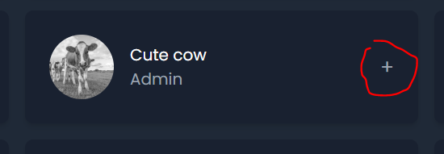
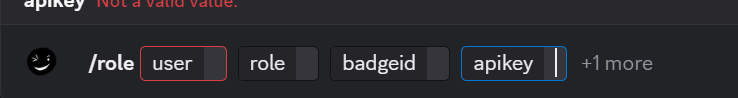
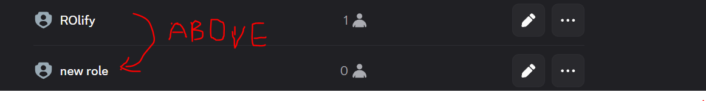
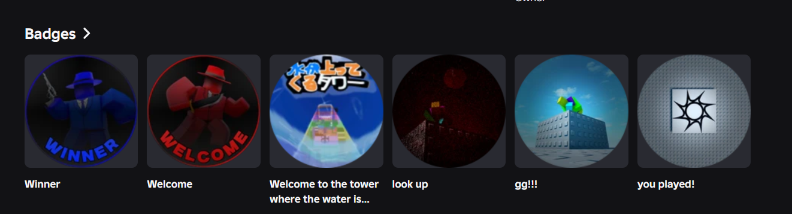
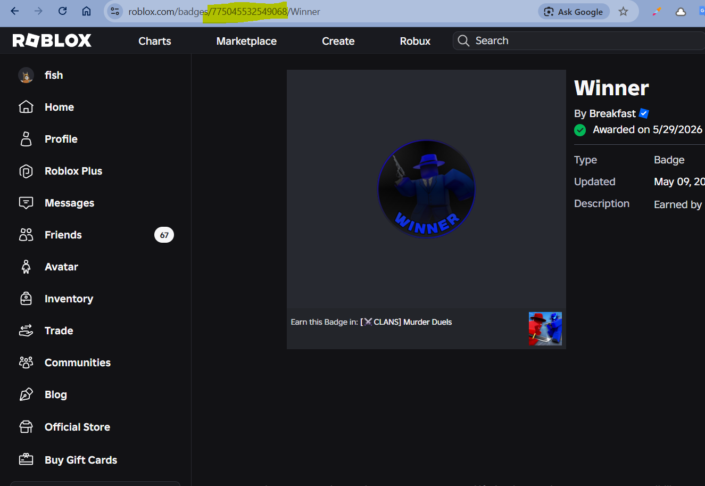
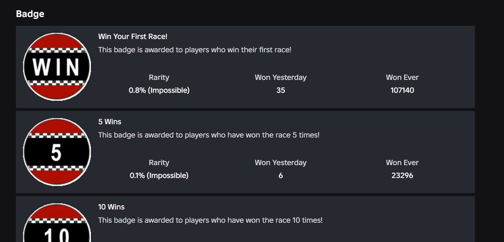

# About

This is a Discord bot which gives users roles based on whether or not they own a Roblox badge.  
Add it to your server here: https://discord.com/oauth2/authorize?client_id=1489809504685133977&permissions=1101927548928&integration_type=0&scope=bot  
NOTE: TO ENSURE THE BOT IS ABLE TO CONFIGURE ROLES, DRAG THE AUTOMATICALLY GENERATED ROLE ABOVE THE ROLES YOU WANT IT TO BE ABLE TO ASSIGN.  

# Demo
Demo video: https://youtu.be/HM2x9ZBDW78
# Development

The bot integrates with Bloxlink (to get the Roblox user from the Discord account) and the Roblox API (to check if the user has the specified badge). It is hosted using Nest.

# Commands

**/role**
This is the main command. It takes the following inputs:  
_user_: This is the Discord user to check.  
_role_: This is the role to give the user if they own the badge  
_badgeid_: This is the id of the Roblox badge to check for. The bot uses Bloxlink to gather the user's Roblox id from their Discord account, and then the Roblox API from there to check for badge ownership.  
_apikey_: This is the BloxLink API key for the server a command was ran in. It is required since BloxLink API keys are server specific. The default API key will NOT work unless you are in the server this bot was developed for. You can generate a key here: https://blox.link/dashboard/user/developer  
_checktype_: This refers to the type of Roblox item to look for. It defaults to badge if left blank, but you can select assets, gamepasses, and bundles as well.

**/roleall**  
This command is similar to role, except it automatically checks ALL users within the server. It attaches a txt file with the results of the command once it finishes running.

# Startup

1. Add the Roleify bot to your server.
2. Add the Bloxlink bot to your server here: https://blox.link/dashboard/user/servers
   Click the + button.
   
3. Create a Bloxlink API key here: https://blox.link/dashboard/user/developer
   Make sure to select the server you want to use Roleify in.
4. Afterwards, when using the commands, ensure the following conditions are met:
   The "apikey" parameter must have your Bloxlink API key from earlier pasted in
   
   The role given to Roleify to assign MUST be lower in the role hierarchy than the automatically generated Roleify role
   
   The users you are checking must be verified on Bloxlink in order to get their Roblox account from their Discord. Bloxlink verification can be done by following this tutorial: https://www.youtube.com/watch?v=ToltKa0eLd0
   The user should have their Roblox inventory made public, or else the badges can not be accessed by the Roblox API.

# Roblox Badgeid

To get the ID of an owned badge, follow these steps.

1. Go to a Roblox user's profile
2. Scroll down until you see the badges section
   
3. Click on a badge. It should open up in a new tab.
4. Go to the URL and copy the string of numbers. Here, the Badgeid is 775045532549068
   

To get the ID of a badge from a game, click on a game and follow steps 2, 3 and 4 from above.
The badge section should look like this.

